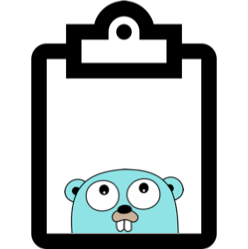

# go-clipboard



A cross-platform clipboard utility for [Go](go.dev).

It offers abilities for copying and pasting plain text.

## installation

```
go get github.com/tiagomelo/go-clipboard
```

## documentation

[https://pkg.go.dev/github.com/tiagomelo/go-clipboard](https://pkg.go.dev/github.com/tiagomelo/go-clipboard)

## platforms

| OS | Supported copy tools | Supported paste tools |
|----------|----------|----------|
| Darwin | `pbcopy` | `pbpaste` |
| Windows | `clip.exe` | `powershell` |
| Linux/FreeBSD/NetBSD/OpenBSD/Dragonfly| X11: `xsel`, `xclip` <br> Wayland: `wl-copy` | X11: `xsel`, `xclip` <br> Wayland: `wl-paste` |
| Solaris | X11: `xsel`, `xclip`| X11: `xsel`, `xclip` |
| Android (via Termux) | `termux-clipboard-set`| `termux-clipboard-get` |

## examples

### copy

[examples/copy/copy.go](examples/copy/copy.go)

```
package main

import (
	"fmt"
	"os"

	clipboard "github.com/tiagomelo/go-clipboard/clipboard"
)

func main() {
	text := "some text"
	c := clipboard.New()
	if err := c.CopyText(text); err != nil {
		fmt.Println(err)
		os.Exit(1)
	}
	fmt.Printf("text \"%s\" was copied into clipboard. Paste it elsewhere.\n", text)
}
```

### paste

[examples/paste/paste.go](examples/paste/paste.go)

```
package main

import (
	"fmt"
	"os"

	clipboard "github.com/tiagomelo/go-clipboard/clipboard"
)

func main() {
	c := clipboard.New()
	text, err := c.PasteText()
	if err != nil {
		fmt.Println(err)
		os.Exit(1)
	}
	fmt.Printf("text from clipboard: %v\n", text)
}

```

## unit tests

### *nix

```
make test
```

### Windows

```
run-tasks.bat test
```